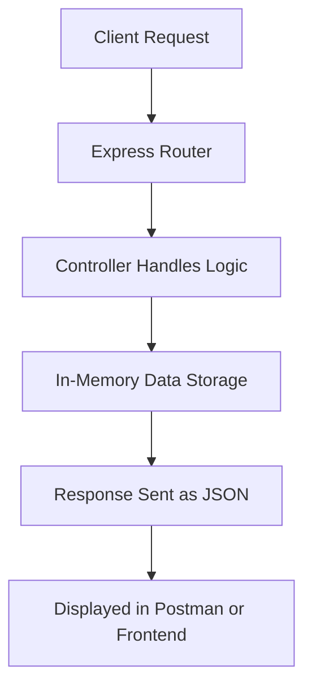

# 🧮 Student Task Manager API (Backend)

A simple and efficient **Student Task Manager System** built with **Node.js** and **Express.js**.  
This backend API helps students **track, manage, and organize their daily assignments or activities**, with full CRUD support and clean JSON responses.

---

## 🎯 Objectives

The main goal of this project is to provide an API for managing tasks effectively.

- Add, view, update, and delete tasks.
- Each task includes a **title**, **description**, **status**, and **creation date**.
- Support for CRUD operations with input validation and structured JSON responses.

---

## ✨ Features at a Glance

| Category | Description |
| :--- | :--- |
| **📝 Add Task** | Create new tasks with title and optional description. |
| **📋 View Tasks** | Retrieve all tasks or filter completed ones. |
| **✏️ Update Task** | Modify title, description, or mark as completed. |
| **🗑️ Delete Task** | Remove tasks permanently. |
| **✅ Optional Feature** | Fetch only completed tasks via `/tasks/completed`. |
| **⚙️ In-Memory Storage** | Tasks are stored temporarily in memory (no database required). |

---

## 🛠️ Tech Stack

| Category | Technology |
| :--- | :--- |
| **Backend Framework** | **Node.js**, **Express.js** |
| **Data Handling** | **In-Memory Array** (temporary storage) |
| **Validation** | Custom validation (title required) |
| **API Testing** | **Postman** |
| **Environment** | **npm**, **nodemon** |

---

## ⚙️ Installation and Setup

Follow the steps below to run the backend locally:

### 1. Clone the Repository
```bash
git clone https://github.com/pateljainil2204/student-assignment
cd student-assignment
```
### 2. Install Dependencies
```
npm install
```
### 3. Install Dependencies
```
npm start   
```
The API will run on:

👉 http://localhost:5000
## 🔗 API Endpoints Overview

| Method | Endpoint | Description |
| :--- | :--- | :--- |
| **POST** | `/tasks` | Create a new task (title required, description optional). |
| **GET** | `/tasks` | Retrieve all tasks. |
| **GET** | `/tasks/completed` | Get only completed tasks. |
| **PUT** | `/tasks/:id` | Update a task (title, description, or mark as completed). |
| **DELETE** | `/tasks/:id` | Delete a task permanently. |

---

## 📘 Example Task Object

```json
{
  "id": "1",
  "title": "Submit assignment",
  "description": "Complete and upload before midnight",
  "isCompleted": false,
  "createdAt": "2025-10-25T10:00:00Z"
}
```
## 🧩 Validation Rules

| Rule | Description |
| :--- | :--- |
| **Title Required** | Every task must have a `title`. |
| **Description Optional** | Can be provided or left blank. |
| **Default Status** | `isCompleted` is `false` when a task is created. |
| **Auto Timestamp** | `createdAt` is automatically added when a task is created. |
| **Invalid Input** | Returns `400 Bad Request` with a clear error message. |

---

## 🧪 Postman Collection (API Testing)

You can test all endpoints easily with **Postman**.  
Each request returns a proper JSON response with relevant success or error messages.

> 💡 Don’t forget to start your local server using:

```bash
npm start
 ```

---

## 🧠 Sample Workflow


## 💡 Future Scope & Enhancements

| Version | Planned Features |
| :--- | :--- |
| **V1.1 (Short-Term)** | Add file-based persistence or a lightweight JSON database to save tasks between restarts. |
| **V2.0 (Mid-Term)** | Integrate **MongoDB** to store tasks permanently with user-specific data handling. |
| **V2.1 (Extended)** | Add **User Authentication** (students log in and manage only their own tasks). |
| **V3.0 (Advanced)** | Implement task reminders, deadlines, and notifications via email or in-app alerts. |
| **Long-Term** | Create a **React.js** frontend dashboard for managing assignments visually. |

---

## 👨‍💻 Author

| Name | Contact | GitHub |
| :--- | :--- | :--- |
| **Jainil Patel** | pateljainil.2204@gmail.com | [github.com/pateljainil2204](https://github.com/pateljainil2204) |

---
